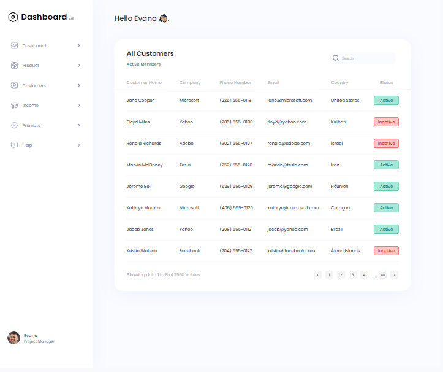

Implemented in the test task:

- valid markup HTML5 and CSS3
- SCSS and Pug
- ВЕМ
- basic JS
- cross-browser compatibility
- adaptive design and semantic markup
- pixel-perfect design
- mobile version
